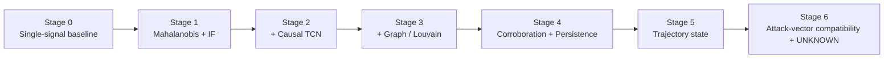

# Architecture evolution

UniAethel was not designed as a four-engine system in one step. The final architecture is the result of a sequence of deliberately tested hypotheses. The stages below are reconstructed from the frozen ablation results, implementation plan, and current source tree.
## Version 1 the failed version has been attached there alongside the drawbacks and improvements

> **Important:** these documents describe the tested development path; they are not presented as a fabricated chronological Git history. The earliest stages are represented by their experimental baselines in `results/ablation.json`.

## Evolution at a glance

| Stage | Main question | Test result / lesson |
|---|---|---|
| 0 | Can a simple scalar threshold detect attacks? | 2/16 detected; too brittle. IF-only detected 0/16. |
| 1 | Does host-relative multivariate geometry help? | Mahalanobis + IF: 6/16. Better, but incomplete. |
| 2 | Does temporal context add information? | +TCN: 8/16; C2 became detectable, but false alerts increased. |
| 3 | Does communication structure add information? | +Graph/Louvain: 10/16; graph removal later showed 4/16. |
| 4 | Can corroboration and persistence suppress transient anomalies? | Persistence lifted detection to 16/16 on the frozen test. |
| 5 | Does the direction of change matter? | Trajectory retained 16/16 and improved the incident state model. |
| 6 | Can known attack vectors be named without forcing unknown cases? | 8/14 known incidents named; 6 rejected; 5/5 unseen pattern incidents rejected as UNKNOWN. |

The exact metrics are in `docs/EXPERIMENTS.md` and `results/ablation.json`.
